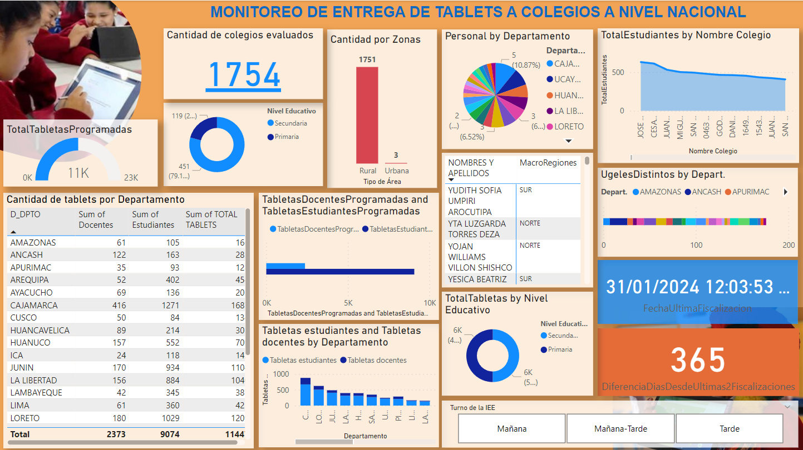

#Informe de Power BI

##Explicación
 El dashboard presenta un análisis detallado del programa implementado por el Ministerio de Educación para cerrar la brecha digital en instituciones educativas a nivel nacional. En el contexto de este proyecto, el Ministerio ha desplegado personal de monitoreo con el objetivo principal de distribuir tabletas a 1,754 Instituciones Educativas (IIEE) en territorio nacional que carecen de equipos. El total de tabletas destinadas para entrega asciende a 11,447, distribuidas entre 9,074 estudiantes y 2,373 docentes.

 El dashboard proporciona visualizaciones claras y concisas que permiten evaluar el avance del programa, destacando el número de tabletas entregadas hasta la fecha, el porcentaje de cobertura alcanzado en relación con el objetivo total y desgloses específicos para estudiantes y docentes. Además, se incluyen métricas clave que ofrecen una visión completa del impacto del programa, permitiendo una toma de decisiones informada para asegurar el éxito continuo del cierre de la brecha digital en el ámbito educativo a nivel nacional.
 
